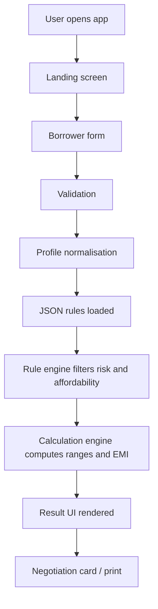
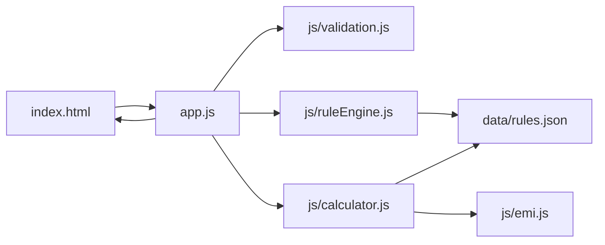
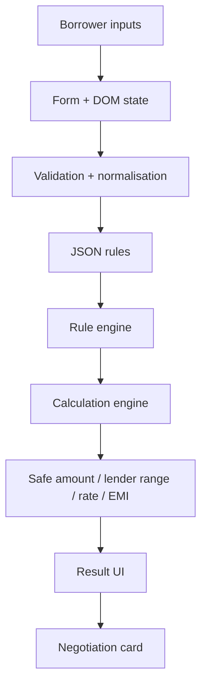

-# Borrower Copilot — Technical & Functional Documentation

## 1. Executive Summary

Borrower Copilot is a browser-based borrower affordability and credit-fit assessment tool. It is designed to help a borrower estimate whether a new loan is sensible, what loan amount may be realistically sanctioned by a lender, what amount is safe to borrow, what fair range of interest rate is reasonable, and what EMI ceiling is sustainable.

The current application is implemented as a static frontend-only project using HTML, CSS and vanilla JavaScript. It does not use a backend, database, authentication layer, or external APIs. Business logic is implemented in JavaScript modules and a JSON configuration file at `data/rules.json`.

The product is intended as decision support and negotiation support, not as a lender approval decision. This is clearly reflected in the UI copy, the calculation logic and the rule assumptions. The app is designed to be transparent, explainable and easy to modify through JSON-driven thresholds.

## 2. Business Problem

The application addresses a common borrowing problem in India: a borrower wants to understand whether a requested loan is affordable before approaching a lender. The tool helps the user answer questions such as:

- Is this loan amount reasonable for my income and existing debts?
- What borrowing amount is safe and comfortable?
- What is a fair rate band for my profile?
- What EMI can I realistically sustain?
- How does a stress scenario such as income drop affect the decision?

This is a decision-support product, not a formal underwriting or sanction system.

## 3. Application Overview

### Name
Borrower Copilot

### Purpose
A borrower self-assessment and affordability estimator for Indian loan scenarios.

### Target users
- Salaried borrowers
- Self-employed borrowers
- Informal or variable-income borrowers
- Borrowers evaluating loan offers or preparing negotiation conversations

### User journey
1. User lands on the landing page.
2. User clicks “Start assessment”.
3. User fills in borrower and financial details.
4. The application validates required data.
5. The profile is normalised and shaped for the rule engine.
6. The rule engine applies income, debt, rate and stability assumptions.
7. The calculation engine estimates lender range, safe range, fair rate, APR and recommended EMI.
8. The result screen displays recommendation and negotiation support.
9. The user can print the negotiation card.

### Core flow



## 4. Technology Stack

| Layer | Technology | Notes |
|---|---|---|
| Frontend | HTML5 | Static page structure |
| Presentation | CSS3 | Styling, layout, responsiveness |
| Logic | Vanilla JavaScript | No framework |
| Rules configuration | JSON | `data/rules.json` |
| Runtime | Browser | Runs client-side |
| Backend | None | Frontend-only |
| Testing | Node.js script | `tests/test-cases.js` |
| Server | Python `http.server` or any static server | Required because JSON is fetched |

## 5. Architecture Overview

### Current architecture
The application is a frontend-only rules-driven architecture. There is no backend, database, routing framework, or API layer.

The actual flow is:

- `index.html` defines the screens and form.
- `app.js` orchestrates screen changes, form collection and result rendering.
- `js/validation.js` validates and normalises input.
- `js/ruleEngine.js` calculates FOIR, confidence, risk flags and decision recommendation.
- `js/calculator.js` orchestrates the final assessment and builds the negotiation card.
- `js/emi.js` contains the reducing-balance EMI calculations and tenure trade-off logic.
- `data/rules.json` holds the configurable business assumptions.

### High-level component interaction



## 6. Project Structure

Actual project structure:

```text
borrower-copilot/
├── index.html
├── styles.css
├── app.js
├── package.json
├── README.md
├── RULES.md
├── data/
│   └── rules.json
├── js/
│   ├── calculator.js
│   ├── emi.js
│   ├── ruleEngine.js
│   └── validation.js
├── tests/
│   └── test-cases.js
└── BORROWER_COPILOT_TECHNICAL_DOCUMENTATION.md
```

### Important files
- `index.html` — UI structure and screens
- `styles.css` — design and layout styling
- `app.js` — screen orchestration and form submission
- `js/validation.js` — validations and normalisation
- `js/ruleEngine.js` — affordability and rule logic
- `js/calculator.js` — assessment calculation and negotiation card
- `js/emi.js` — EMI formula logic
- `data/rules.json` — config-driven thresholds
- `tests/test-cases.js` — scenario runner

## 7. Frontend Architecture

### Framework
There is no framework such as React, Vue or Angular. The project is written in plain JavaScript with DOM APIs.

### Pages/screens
The application currently has these screens as identified in `index.html`:

1. `landing-screen`
2. `form-screen`
3. `results-screen`

These are toggled by the `showScreen(name)` function in `app.js`.

### Routing
There is no SPA router. Navigation is implemented by toggling CSS classes, not by browser route changes. `showScreen()` adds or removes `hidden` and `active` classes.

### State management
State is mostly kept in the DOM and in local JavaScript variables. There is no global state library, React state store or framework-level state management. Main state flows:

- form field values from `FormData`
- `rules` variable loaded from JSON
- `profile` object assembled in `collectProfile()`
- `assessment` object created by `calculateAssessment()`

### Form handling
The form is defined in `index.html` and bound in `app.js`:

```javascript
ui.borrowerForm.addEventListener('submit', (event) => {
  event.preventDefault();

  const profile = collectProfile();
  const assessment = calculateAssessment(profile, rules);

  if (!assessment.valid) {
    alert(assessment.errors.join('\n'));
    return;
  }

  renderResults(assessment);
  showScreen('results');
});
```

### Conditional UI logic
The project uses dynamic question cards which are displayed or hidden based on field values:

- `conditionalQuestions()`
- `shouldShowAnyQuestion()`

These checks use `data-depends-on` attributes on `.adaptive-card` elements.

## 8. Backend Architecture

### Current status
There is no backend.

### What exists
- Static HTML/CSS/JS files
- JSON rule file
- Browser-only execution

### What does not exist
- API server
- Database
- Authentication
- Authorization
- Session management
- Persistent user storage
- Server-side validation

### Business logic location
The business logic resides in client-side JavaScript modules:

- `js/ruleEngine.js`
- `js/calculator.js`
- `js/emi.js`
- `js/validation.js`

This means the whole risk and affordability model is executed in the browser at runtime.

## 9. Rule Engine and JSON Configuration

The config file is `data/rules.json`. It is central to the application and directly affects outcomes without changing UI code.

### Top-level structure

| Section | Purpose |
|---|---|
| `bankingAssumptions` | Core affordability assumptions |
| `foir` | FOIR thresholds by income type |
| `creditBands` | Credit score ranges and rate adjustments |
| `incomeStability` | Stability multipliers |
| `products` | Product-specific loan metadata |
| `riskAdjustments` | Risk-based pull-downs for debt and volatility |
| `confidence` | Confidence scoring inputs |
| `decisionThresholds` | Thresholds for "borrow less" and "don’t borrow" |
| `defaultQuestions` | Default field/help text context |

### Important JSON fields and their effect

#### `bankingAssumptions`
- `minimumSurplusRatio`: 0.15
- `minimumEmergencyMonths`: 3
- `stressIncomeDrop`: 0.2
- `stressRateRisePoints`: 2
- `unknownCreditPenalty`: 0.15
- `baselineLivingCostBuffer`: 0.1
- `lenderRatioBuffer`: 0.9

These values are used in affordability and stress calculations.

#### `foir`
- `salaried`: 0.48
- `selfEmployed`: 0.42
- `informal`: 0.35
- `base`: 0.4
- `securedComfort`: 0.55

Used by `determineFoir()` in `js/ruleEngine.js`.

#### `creditBands`
Contains ranges such as:
- Excellent: 750–900
- Good: 700–749
- Fair: 650–699
- Weak: 550–649
- Poor: 300–549

Each band includes a `rateAdjustment` value. Credit score affects rate range and confidence.

#### `incomeStability`
- `stable`: 1
- `moderate`: 0.88
- `volatile`: 0.75
- `unknown`: 0.8

Applied as a multiplier in affordability logic.

#### `products`
Each product entry defines:
- `label`
- `secured`
- `interestRateBand`
- `processingFeePct`
- `maxTenureMonths`
- `defaultTenureMonths`
- `sanctionMultiplier`
- `riskWeight`
- `allowCollateral`
- `preferredFor`

Products implemented in the current JSON:
- `personal_loan`
- `home_loan`
- `lap`
- `gold_loan`
- `two_wheeler_loan`
- `business_loan`

#### `riskAdjustments`
These are used to tone down affordability or confidence when certain risk conditions apply:
- `recentEMIBounce`: 0.7
- `highCostDebt`: 0.82
- `unknownCreditScore`: 0.86
- `incomeVolatility`: 0.78
- `lowEmergencySavings`: 0.85
- `largeUpcomingExpense`: 0.8
- `coAppIncomeBoost`: 0.12
- `collateralBoost`: 0.12
- `businessProfitBoost`: 0.08

#### `confidence`
Used by `calculateConfidence()`. Base and penalties/bonuses alter confidence levels.

#### `decisionThresholds`
- `borrowLessRatio`: 0.8
- `doNotBorrowStressRatio`: 0.65
- `minSafeResidualPercent`: 0.12
- `highDebtRatio`: 0.52
- `recentBounceCritical`: true

These control recommendation outcomes.

### How rules are consumed
The app loads the JSON file in `app.js` via `fetch('./data/rules.json')` and stores it in the `rules` variable.

Then downstream functions consume it:

- `getProductRules(productKey, rules)`
- `getCreditBand(score, rules)`
- `determineFoir(profile, rules)`
- `getRiskFlags(profile, rules)`
- `calculateConfidence(profile, rules)`
- `decideRecommendation(safeRange, requestedAmount, riskFlags, rules)`
- `calculateAssessment(profile, rules)`

This is a configuration-driven rather than hardcoded architecture.

## 10. Component-by-Component Documentation

### 10.1 `index.html`
**Purpose:** Defines the page structure, screens, form fields, results layout and negotiation card.

**Main sections:**
- Landing screen
- Borrower form screen
- Results screen
- Negotiation card

**Input fields:**
The form includes fields for age, loan purpose, loan type, requested amount, net income, income type, existing EMI, household expenses, credit score, employment tenure, business details, collateral, co-applicant income, emergency savings and stress indicators.

**Outputs:**
- `#primary-recommendation`
- `#lender-range`
- `#safe-range`
- `#fair-rate-range`
- `#apr-range`
- `#recommended-emi`
- `#stress-status`
- `#card-*` fields

**State:**
DOM state is updated dynamically but not managed in a framework store.

### 10.2 `app.js`
**Purpose:** Orchestrates the user flow and UI updates.

**Important functions:**
- `showScreen(name)`
- `toggleCreditScoreField()`
- `conditionalQuestions()`
- `shouldShowAnyQuestion()`
- `renderTradeoff(tradeoffs)`
- `renderResults(assessment)`
- `collectProfile()`
- `loadRules()`
- `init()`

**Input:**
- Form value collection
- `rules.json`

**Outputs:**
- Screen switching
- DOM content updates
- Result rendering

**User interaction flow:**
User clicks Start → form visible → button submission → `calculateAssessment()` → `renderResults()` → final screen visible.

### 10.3 `js/validation.js`
**Purpose:** Validates required values and normalises output for downstream calculations.

**Functions:**
- `validateBorrowerProfile(profile)`
- `normaliseProfile(profile)`

**Validation behavior:**
- Age between 18 and 75
- Positive monthly income
- Positive desired amount
- Existing EMI non-negative
- Household expenses non-negative
- Valid loan type and income type
- Credit score 300–900 when provided

**Normalisation behavior:**
- Converts unknown or blank credit score to `null`
- Coerces numeric fields to numbers
- Sets default values for unspecified fields

### 10.4 `js/ruleEngine.js`
**Purpose:** Encodes affordability, risk and decision logic.

**Functions:**
- `getProductRules(productKey, rules)`
- `getCreditBand(score, rules)`
- `getIncomeTypeMultiplier(profile, rules)`
- `determineFoir(profile, rules)`
- `getRiskFlags(profile, rules)`
- `calculateConfidence(profile, rules)`
- `decideRecommendation(safeRange, requestedAmount, riskFlags, rules)`

**Examples:**
- `determineFoir()` uses `incomeType` and `incomeStability` to determine affordability ceiling.
- `getRiskFlags()` marks conditions such as high debt ratio, recent EMI bounce, volatility and unknown credit score.
- `decideRecommendation()` returns `BORROW`, `BORROW LESS`, or `DON'T BORROW`.

### 10.5 `js/calculator.js`
**Purpose:** Full assessment calculation and final output builder.

**Key functions:**
- `formatINR(value)`
- `formatINRCompact(value)`
- `calculateAssessment(profile, rules)`
- `buildNegotiationCard(assessment)`

**Outcomes produced:**
- lender range
- safe amount range
- fair rate
- APR range
- recommended EMI
- stress test result
- confidence level
- key reasons
- negotiation card payload

### 10.6 `js/emi.js`
**Purpose:** EMI and reducing-balance calculations.

**Functions:**
- `calculateEMI(principal, annualRatePercent, months)`
- `calculateTotalRepayment(principal, annualRatePercent, months)`
- `calculateTotalInterest(principal, annualRatePercent, months)`
- `calculateLoanAmountForEMI(emi, annualRatePercent, months)`
- `buildTenureTradeoff(loanAmount, annualRatePercent)`

**Important detail:**
The EMI formula is a standard reducing-balance method. It is used for recommended EMI and for tenure trade-off display.

### 10.7 `tests/test-cases.js`
**Purpose:** Executes a scenario suite for validation and consistency testing.

**Included scenarios:**
- Priya
- Ravi
- Anita
- UnknownCreditScore
- HighExistingEMI
- HighCostDebt
- IncomeStress
- RateRise

This is a real functional validation harness for the rule engine and calculation model.

## 11. Business Logic / Rule Engine

### 11.1 Main affordability thinking
The app uses an affordability model based on monthly income and debt burden. The logic is not a direct lender policy; it is a borrower decision-support model.

The general structure is:

1. Determine income type and FOIR threshold.
2. Calculate maximum EMI capacity.
3. Subtract existing EMI.
4. Check monthly household expenses and a minimum surplus buffer.
5. Adjust for emergency savings, debt stress, volatility and recent bounce.
6. Determine a recommended EMI and safe amount.
7. Compare requested loan amount against the safe range and recommendation thresholds.

### 11.2 Core rule categories

#### A. Income / FOIR rules
FOIR values are derived from `rules.foir`.

- Salaried: 48%
- Self-employed: 42%
- Informal: 35%
- Base default: 40%

The function `determineFoir()` multiplies the base by a stability adjustment according to income type.

#### B. Debt burden rules
The code flags a borrower as high debt if:

```javascript
(profile.existingEMI / profile.netIncome) > rules.decisionThresholds.highDebtRatio
```

The threshold value is 0.52 (52%).

#### C. Recent EMI bounce rule
If `profile.recentEMIBounce` is true, a risk flag is added and the recommendation logic heavily penalizes the application.

#### D. Unknown credit score rule
If `creditScore` is null, the app reduces affordability and confidence and widens the fair rate range.

#### E. Emergency savings rule
If emergency savings months are below 3, `maxNewEMI` is reduced by 15%.

#### F. Stress test rule
The application simulates a 20% income drop (`stressIncomeDrop` in `rules.json`) and prints a stress narrative.

#### G. Borrow less / do not borrow decision rules
The recommendation engine uses:
- `borrowLessRatio`: 0.8
- `doNotBorrowStressRatio`: 0.65

This means:
- If requested amount is well above safe range, recommendation becomes `BORROW LESS` or `DON'T BORROW`.
- If debt stress and recent EMI bounce are both present, the result is `DON'T BORROW`.

### 11.3 Risk and confidence logic
`calculateConfidence()` sets a confidence band HIGH, MEDIUM or LOW based on such factors as:
- missing credit score
- incomplete data
- income volatility
- debt obligations
- emergency savings

### 11.4 Recommendation logic
`decideRecommendation()` is the final decision engine. It returns one of the three recommendations currently implemented:
- `BORROW`
- `BORROW LESS`
- `DON'T BORROW`

The logic is intentionally straightforward: it is a borrower guidance engine rather than an automated scoring system.

## 12. Complete User Journey

### Step 1: User opens application
**What user sees:** The landing page with a product headline and CTA.

**Code executed:** `init()` loads JSON from `data/rules.json` and toggles UI state.

### Step 2: User starts assessment
**What user sees:** Form screen appears.

**Code executed:** `showScreen('form')`

### Step 3: User fills the form
**What user does:** Inputs age, loan type, income, EMI and other relevant details.

**Code executed:** `collectProfile()` builds a JavaScript object from form values.

### Step 4: Validation occurs
**Code executed:** `validateBorrowerProfile()` and `normaliseProfile()`.

**Outcome:**
- valid profile → continue
- invalid profile → alert modal with errors

### Step 5: Rule evaluation happens
The app configures risk and affordability using `rules.json` and functions in `ruleEngine.js`.

### Step 6: Calculation occurs
`calculateAssessment()` computes:
- FOIR
- lender sanction range
- safe borrowing range
- fair rate range
- APR range
- recommended EMI
- stress status
- confidence

### Step 7: Result is presented
`renderResults()` populates the DOM fields in the results screen.

### Step 8: Negotiation card is generated
`buildNegotiationCard()` builds the print-friendly summary card.

### Step 9: User prints or saves
The print button triggers `window.print()`.

## 13. Data Flow

```mermaid
flowchart LR
    A[Form inputs] --> B[collectProfile()]
    B --> C[normaliseProfile()]
    C --> D[validateBorrowerProfile()]
    D --> E[calculateAssessment()]
    E --> F[ruleEngine.js]
    E --> G[emi.js]
    E --> H[output object]
    H --> I[renderResults()]
    I --> J[UI display]
    H --> K[buildNegotiationCard()]
    K --> L[Print card]
```

### Input data
- age
- loan purpose
- loan type
- desired amount
- net income
- income type
- existing EMI
- household expenses
- credit score
- collateral and debt risk details

### Derived data
- annual income
- max total EMI capacity
- affordability EMI estimate
- lender range
- safe range
- stress debt burden

### Static configuration
`data/rules.json` is static configuration used during calculation.

### Final output
- recommendation (`BORROW`, `BORROW LESS`, `DON'T BORROW`)
- lender range
- safe range
- fair rate
- APR
- recommended EMI
- negotiation card text

## 14. Validation & Error Handling

### Implemented validation
The validation layer includes:
- numerical positivity checks
- age range checks
- valid income type checks
- valid loan type checks
- credit score range check if known
- negative value checks for EMI and household expenses

### Error behavior
When validation fails, `calculateAssessment()` returns:

```javascript
{
  valid: false,
  errors: validation.errors,
  recommendation: null
}
```

Then `app.js` triggers:

```javascript
alert(assessment.errors.join('\n'));
```

### Missing values and unknowns
The app treats unknown credit score as `null`, which is an intentional design choice documented in `RULES.md` and implemented in `normaliseProfile()`.

### Not implemented
The app does not currently have:
- API-level validation
- server-side sanitisation
- structured error modal UI beyond `alert()`
- retry logic
- error state pages
- loading states

## 15. Edge Cases

### Currently handled
- Unknown credit score (`null`)
- Very high existing EMI
- High debt ratio
- Volatile income
- Recent EMI bounce
- Collateral available / not available
- Business vs consumer loan decisioning
- Stress scenario for income drop

### Currently not handled
- Real lender policy integration
- OCR/identity verification
- Duplicate form submissions protection
- Bundled or repeated discounting logic
- Real-time validation for every field on blur
- Mobile-specific UX beyond responsive CSS
- Multi-user concurrency or historical data

### Recommended future improvements
- more explicit error summary UI
- rule schema validation
- persisted user drafts
- more structured decision explanations

## 16. UI/UX Documentation

### Landing screen
**Purpose:** Introduce the borrower assessment, set tone and prompt action.

**UI components:**
- hero panel
- CTA button
- preview metrics
- brand block

### Form screen
**Purpose:** Gather data points needed for affordability and risk calculation.

**Structure:**
- section blocks for personal info, finances, borrowing plan
- adaptive questions area
- form actions

**UX pattern:**
The adaptive questions appear only when relevant based on user input such as income type or collateral availability.

### Results screen
**Purpose:** Present final recommendation, ranges and explanation.

**Displayed values:**
- recommendation
- safe range
- lender range
- fair rate
- APR
- EMI ceiling
- stress status
- reasons list

### Negotiation card
**Purpose:** Produce a print-friendly summary for borrower conversations or loan discussions.

Included data:
- loan type
- requested amount
- borrowing range
- lender sanction range
- rate range
- APR range
- EMI
- reasons
- negotiation statement

### Responsive behavior
The CSS is designed as a responsive front-end layout. The code does not rely on a specific frontend framework, so responsiveness is driven by CSS rules and layout classes.

## 17. Security Analysis

### Currently implemented
- No backend, so no server-side credentials or private keys are used.
- No authentication is required.
- No personal data storage occurs.
- No API keys are used.
- No database is present.

### Risks and limitations
- Client-side validation is not a security boundary.
- Values can be manipulated in-browser because the entire logic runs in the client.
- Rules JSON can be altered by anyone with local access to the static project.
- There is no sanitisation layer beyond basic input type checks.

### Security conclusion
This is a low-risk educational tool, but it is not production-grade for real financial decisions. It should not be treated as secure underwriting software.

## 18. Performance & Scalability

### Current performance profile
The app is lightweight and runs entirely on the browser. For a single user, performance is excellent.

### Major performance patterns
- small JSON file
- small DOM tree
- lightweight JS modules
- synchronous DOM updates
- no network-heavy API calls

### Bottlenecks
- large rule sets would increase complexity
- a larger number of adaptive questions could make form logic more complex
- no caching or server-side processing for heavier data

### 10x scale scenario
If traffic increased 10x, the app would still likely run well because it is static and lightweight. However:
- browser-side logic would still be executed on each client
- rule validation and calculation would not be centrally controlled
- there would be no observability or server-side analytics

### Recommended scaling improvements
- move rule evaluation to a backend service for governance
- use API-driven configuration management
- add monitoring and analytics
- improve validation with schema checks

## 19. Testing

### Current testing implementation
The project includes `tests/test-cases.js`.

This script exercises multiple case scenarios and prints results to the console.

### Current test coverage concepts
- happy path scenario
- unknown credit score
- high debt case
- income stress case
- rate-rise stress case
- multiple different borrower types

### Missing tests
- UI automation tests
- browser-end-to-end tests
- negative validation tests for malformed input
- strict JSON schema validation tests
- regression tests for DOM rendering
- accessibility checks

### Recommended test strategy
1. Unit tests for `normaliseProfile()` and `validateBorrowerProfile()`
2. Rule tests for each JSON threshold
3. Scenario tests for borrowers
4. UI tests for screen transitions
5. Regression tests after changing rules

## 20. Deployment

### Current deployment mode
The project currently runs as a static site.

### Actual command used
```bash
cd borrower-copilot
python -m http.server 8000
```

Then open:
```text
http://localhost:8000
```

### Production status
This is not yet a production deployment pipeline. There is no CI/CD setup, build pipeline, environment config or deployment automation in the repository.

### Static hosting consideration
This project could be served from a simple static host, but it should be treated as a local frontend prototype unless it is hardened for production use.

## 21. Design Decisions

### Why plain JavaScript?
Because the project is intentionally lightweight and browser-based. There is no backend or framework requirement.

**Advantages:**
- simple to run
- easy to inspect
- no dependency overhead
- quick for a prototype

**Disadvantages:**
- less maintainable at scale
- no formal component architecture
- no framework-level state tooling

### Why JSON-driven rules?
The project is explicitly designed to allow thresholds to change without modifying the UI.

**Advantages:**
- easier to adjust business logic
- transparent rule tuning
- quick scenario testing

**Disadvantages:**
- JSON is not schema-validated
- users could alter important assumptions without safeguards

### Why no backend?
Because the app is described as a browser-only educational tool and no backend capability was implemented.

## 22. Current Implementation Limitations

### Current situation
This project is a working educational decision-support prototype, not a production underwriting engine.

### Impact
It should not be relied on for real lending decisions or compliance-critical financial workflows.

### Recommended improvement
- Add backend governance for rules
- Add stronger input validation and schema support
- Add proper logging and error handling
- Move sensitive logic server-side

## 23. Future Improvements

### Priority 1 — Critical
- schema validation for `rules.json`
- stronger UI validation and error UX
- backend rule engine for production governance

### Priority 2 — Important
- structured logging
- multi-screen or dashboard expansion
- richer explanation engine
- improved test automation

### Priority 3 — Nice to Have
- PDF export enhancement
- exported reports
- more product categories
- lender-specific data integration

## 24. Interview Preparation

### A. Project Overview Questions

#### Q: Explain your project.
**Answer:** Borrower Copilot is a browser-based affordability and borrowing-fit tool for Indian borrowers. It helps estimate whether a proposed loan is reasonable, how much is safe to borrow, what rate band is fair and what EMI ceiling is sustainable.

#### Q: What problem does it solve?
**Answer:** It helps users avoid borrowing beyond their affordability and gives them a structured way to compare requested amount, lender range and safe range before negotiating with a lender.

#### Q: What is the architecture?
**Answer:** It is a static frontend-only app using HTML, CSS and vanilla JavaScript. The logic is split across validation, rules and calculation modules and uses a JSON rule file for assumptions.

### B. Architecture Questions

#### Q: Why did you choose this architecture?
**Answer:** The project is intentionally lightweight and transparent. A static frontend is sufficient for a calculator-like tool, and JSON-based rule configuration makes business assumptions adjustable without code changes.

#### Q: Why not use a framework?
**Answer:** Because the scope is a self-contained decision-support tool. The project does not require routing, authentication or a backend, so plain JavaScript kept it simple and inspectable.

### C. Business Logic Questions

#### Q: What is the main business rule?
**Answer:** The main rule is affordability: the app estimates how much EMI a borrower can support based on income, existing EMI, household expenses and FOIR-like thresholds, with conservative adjustments.

#### Q: What happens when credit score is unknown?
**Answer:** It is normalised to `null` and treated as a risk factor. Confidence is reduced and the fair rate range is widened.

### D. JSON Rule Questions

#### Q: Why use JSON for rules?
**Answer:** Because the app is designed to make the business assumptions configurable without touching the UI or logic. Changing a threshold in `data/rules.json` changes the results automatically.

#### Q: What happens if JSON is malformed?
**Answer:** The current implementation does not include schema validation or explicit error handling for malformed JSON. The app assumes the file is valid because the project currently uses a static, controlled JSON file.

### E. Frontend Questions

#### Q: Explain the component hierarchy.
**Answer:** The UI is made of HTML screens and form sections. The main logic lives in `app.js`, not in a component library. Screen transitions are based on CSS class toggles.

### F. Security Questions

#### Q: What are the security limitations?
**Answer:** This app is not production-grade from a security perspective because all logic runs client-side and any user can inspect or alter it. It is intended for educational and decision-support use only.

### G. Testing Questions

#### Q: How do you test this?
**Answer:** The project includes a Node-based scenario script, `tests/test-cases.js`, which exercises multiple borrower profiles and prints calculated results.

## 25. Project Explanation — 30 Seconds

Borrower Copilot is a browser-based borrowing assessment tool for Indian borrowers. It collects borrower details, validates them, applies a rule-driven affordability model, calculates a lender range, safe borrowing amount, fair rate band, APR and EMI ceiling, and presents the result in a clear negotiation-friendly format. It is a frontend-only educational tool, not a lender approval engine.

## 26. Project Explanation — 2 Minutes

Borrower Copilot is a decision-support app for evaluating whether a loan request is affordable and sensible. It is built as a static browser application with HTML, CSS and vanilla JavaScript. There is no backend, no database and no authentication. The user starts by entering basic information such as income, existing EMI, loan type, credit score and vulnerability factors like recent EMI bounce or income volatility.

On submission, the app validates the inputs and normalises the profile. It then loads a rules file from `data/rules.json`, which contains the affordability thresholds, rate assumptions and risk adjustments. These values feed into functions in `js/ruleEngine.js` and `js/calculator.js`, which decide the risk level, confidence, safe borrowing amount, lender sanction range, fair rate band and recommended EMI. The result is rendered in the UI, and a print-friendly negotiation card can be generated for borrower discussions.

The app intentionally does not pretend to be a lender sanction. It is designed to be transparent, explainable and rule-driven, and all major assumptions are deliberately configurable in the JSON file rather than hardcoded into the UI.

## 27. Project Explanation — 5 Minutes

Borrower Copilot is a frontend-only borrowing decision-support tool designed for a borrower who wants to understand whether they are taking on a sensible amount of debt. It is not a credit bureau or lender approval tool, and it does not store data or require login. The purpose is to estimate affordability and to aid negotiation discussions around fair rate and sensible debt burden.

The application architecture is intentionally simple. The form is in `index.html`. The logic is split across `app.js`, `js/validation.js`, `js/ruleEngine.js`, `js/calculator.js` and `js/emi.js`. The rules are externalised in `data/rules.json`, which drives FOIR assumptions, credit score bands, rate ranges, stress assumptions and decision thresholds. That means the product is configuration-driven rather than fully hardcoded.

When the user submits the form, the app builds a `profile` object, validates it, normalises it, and calls the assessment engine. The engine uses income type, current EMI, household costs, collateral availability, emergency savings and volatility to compute a maximum safe EMI and a safe loan range. It then compares the requested value with the safe range and eligibility assumptions and decides either `BORROW`, `BORROW LESS` or `DON'T BORROW`.

The app also calculates a fair rate band and APR estimate using product-specific assumptions and the user’s risk inputs. It outputs the result in a clean summary and generates a print card. The project is intentionally transparent and explainable so a borrower can understand why the decision is being made. The main limitation is that it is a static educational prototype, not production-grade underwriting or lender integration.

## 28. Whiteboard Explanation

### Diagram



### Walkthrough for interviewer
“On the left is the borrower form. The user enters the loan amount, income, debt, collateral and risk signals. The values are collected and validated. Then the profile is normalised and passed into the rule engine, which reads the assumptions from the JSON file. Those rules decide the FOIR, rate band, risk penalties and the final recommendation. The calculation engine then produces the safe amount, lender range, EMI and stress result, and that output is rendered in the result screen and negotiation card.”

## 29. Rapid-Fire Questions

1. What architecture does the project use?  
   It is a static browser-only frontend with no backend.

2. What is the main entry point?  
   `index.html` loads `app.js` and the CSS file.

3. Where are the rules stored?  
   In `data/rules.json`.

4. Where do the calculations happen?  
   In `js/calculator.js`, `js/ruleEngine.js` and `js/emi.js`.

5. What's the main validation file?  
   `js/validation.js`.

6. Does the app have a backend?  
   No.

7. Does it store user data?  
   No.

8. What is the result recommendation logic based on?  
   Safe range, debt stress, recent EMI bounce and affordability thresholds.

9. What is the purpose of `normaliseProfile()`?  
   To convert raw form values into a consistent numeric structure and handle unknown credit scores.

10. What happens if credit score is unknown?  
    It is converted to `null` and the risk and confidence logic widens the range.

11. What is the role of `data/rules.json`?  
    It defines affordability assumptions and product assumptions.

12. How does the app switch screens?  
    It toggles CSS classes using `showScreen()`.

13. What is the final output?  
    Recommendation, lender range, safe range, fair rate, APR and EMI.

14. Is this a lender approval system?  
    No.

15. Which file handles EMI formula?  
    `js/emi.js`.

16. Which file decides `BORROW` vs `DON'T BORROW`?  
    `js/ruleEngine.js`.

17. Does the app call an API?  
    No.

18. What does the app do with `window.print()`?  
    It prints the negotiation card.

19. How is the app started locally?  
    With a static server such as `python -m http.server 8000`.

20. What is the default testing mechanism?  
    Node script in `tests/test-cases.js`.

21. What is the biggest limitation?  
    It is a frontend-only prototype without production-grade governance and security.

22. What is the role of `defaultQuestions` in JSON?  
    It contains explanatory labels for why questions exist.

23. Does the project use a framework?  
    No.

24. Does it use local storage?  
    No.

25. What does `riskAdjustments` do?  
    It reduces affordability based on factors like recent EMI bounce or volatile income.

26. What is the stress scenario in the app?  
    A 20% drop in income and a 2-point rate increase assumption.

27. What is the safe amount?  
    A more conservative borrowing range than the lender sanction range.

28. Why is safe amount lower than lender sanction?  
    Lender approval is not the same as affordable repayment comfort.

29. What is the purpose of `confidence`?  
    To indicate how reliable the estimate is based on data quality and risk stability.

30. What file defines the product metadata?  
    `data/rules.json` under `products`.

31. Which file contains UI-specific interactive logic?  
    `app.js`.

32. Which file contains pure business calculation logic?  
    `js/ruleEngine.js` and `js/calculator.js`.

33. Which file is the EMI formula engine?  
    `js/emi.js`.

34. What happens if a user enters invalid values?  
    Validation fails and an alert appears.

35. What is the app intended to support?  
    Borrower education and negotiation preparation.

36. Does the app support authentication?  
    No.

37. Which fields are dynamically shown or hidden?  
    The `adaptive-card` elements based on `data-depends-on`.

38. What does `collectProfile()` do?  
    It reads the form with `FormData` and creates the borrower profile object.

39. What are the default product types?  
    `personal_loan`, `home_loan`, `lap`, `gold_loan`, `two_wheeler_loan`, `business_loan`.

40. Why are financial assumptions in JSON instead of hardcoded?  
    To allow business changes without changing the app code.

41. Which file currently drives the rule assumptions?  
    `data/rules.json`.

42. Is the app stateful across page reloads?  
    No.

43. What is the role of `result-panel`?  
    It displays the key affordability and financing outputs.

44. What does `buildNegotiationCard()` do?  
    It creates a print-friendly summary card for lender conversations.

45. Does it support multi-page routing?  
    No.

46. Is there any local persistence?  
    No.

47. What would break if `data/rules.json` changes incorrectly?  
    The calculation outputs and recommendation could shift unexpectedly.

48. What would be a stronger next step for production?  
    A backend rule service with validation and versioning.

49. Is the app right for regulated financial decisions?  
    Not as implemented.

50. What is the value of the project in an interview?  
    It shows rule-driven frontend design, configuration-driven business logic, and a clear financial decision model.

51. Is the app mobile-friendly?  
    The CSS is designed responsively, but there is no specific mobile app framework.

52. What is the product’s conservative bias?  
    It prefers affordability and safety over aggressive lender approval assumptions.

53. Is there any external integration?  
    No.

54. Is the app secured against malicious input?  
    Only to a limited extent through basic validation; it is not a hardened financial system.

55. What does JSON allow business users to do?  
    Adjust thresholds without changing code, subject to technical validation and governance.

## 30. Tricky Interview Questions

### 1. What is the weakest part of the implementation?
It is a frontend-only static app. The calculation is visible to the client and is not protected by a backend or audit layer.

### 2. What would you change if you had another week?
I would add strict JSON schema validation, a clearer error UX, and a proper backend rule service for versioning and governance.

### 3. What part would fail first at scale?
The app would remain lightweight, but governance, observability and security are the first weak points if it becomes used operationally.

### 4. What happens if the rule JSON becomes corrupted?
The app would likely produce inconsistent results because there is no schema validation or defensive loading logic.

### 5. How would you prove the calculation is correct?
By testing representative borrower scenarios and validating them against the financial assumptions in `rules.json` and `tests/test-cases.js`.

### 6. What is the least robust technical decision?
The lack of backend governance and the direct client-side execution of all business logic.

### 7. Why not store this data in a database?
Because the project deliberately keeps the app simple and static, and no database existed in the current implementation.

### 8. What is the security gap?
The app cannot enforce trust boundaries in the browser.

### 9. What is the main business logic trade-off?
It prefers transparency over strict lender policy realism.

### 10. Could a user game the calculator?
Yes, because all logic is visible and client-managed.

## 31. Final Cheat Sheet

### Tech stack
- HTML5
- CSS3
- Vanilla JavaScript
- JSON
- Node.js test script
- Python static server

### Architecture
- Frontend-only static app
- DOM-based state
- JSON-driven rules
- client-side calculation engine

### Key files
- `index.html`
- `styles.css`
- `app.js`
- `js/validation.js`
- `js/ruleEngine.js`
- `js/calculator.js`
- `js/emi.js`
- `data/rules.json`
- `tests/test-cases.js`

### Main rules
- FOIR by income type
- credit score bands
- debt stress logic
- recent EMI bounce penalty
- income volatility adjustment
- recommended EMI range

### Main calculations
- affordability EMI capacity
- lender sanction range
- safe borrowing range
- fair rate range
- adjusted APR estimate
- EMI using reducing-balance formula

### Key design decisions
- configuration-driven business rules
- static browser execution
- simple screen toggling instead of routing
- print-friendly negotiation card

### Known limitations
- no backend
- no data persistence
- no authentication
- no production security controls
- no schema validation for rules

### Security points
- No user data storage
- No backend secret handling
- No external API usage
- Client-side trust limitations

### Performance points
- Lightweight static app
- fast local execution
- limited scale concerns for small usage but not hardened for production-level financial workflows

### Testing points
- `tests/test-cases.js` covers borrower scenarios and financial outputs

### 2-minute explanation
Borrower Copilot is a browser-based borrowing decision-support tool. It collects borrower data, validates it, applies a configurable rule engine from `data/rules.json`, estimates safe borrowing, lender sanction range, fair rate band and EMI ceiling, and presents the final recommendation. It is built as a frontend-only educational tool and is intentionally transparent rather than a formal lender approval decision engine.

## 32. Final Consistency Check

This document was written against the actual codebase and not against an assumed architecture.

Verified files used as source of truth:
- `index.html`
- `app.js`
- `js/validation.js`
- `js/ruleEngine.js`
- `js/calculator.js`
- `js/emi.js`
- `data/rules.json`
- `tests/test-cases.js`
- `README.md`
- `RULES.md`

This documentation clearly separates what is implemented from what is not currently implemented.

## 33. Conclusion

Borrower Copilot is a demonstrably working, browser-only affordability and negotiation support tool. It is structured around a transparent rule engine, JSON-configured assumptions, and a vanilla JavaScript calculation model. The implementation is strong from the perspective of explainability, configurability and simplicity, but it is intentionally not a production finance system. Its value lies in being a clear, technically sound and interview-friendly project that demonstrates financial logic, rule-driven design and end-user-focused output generation.
